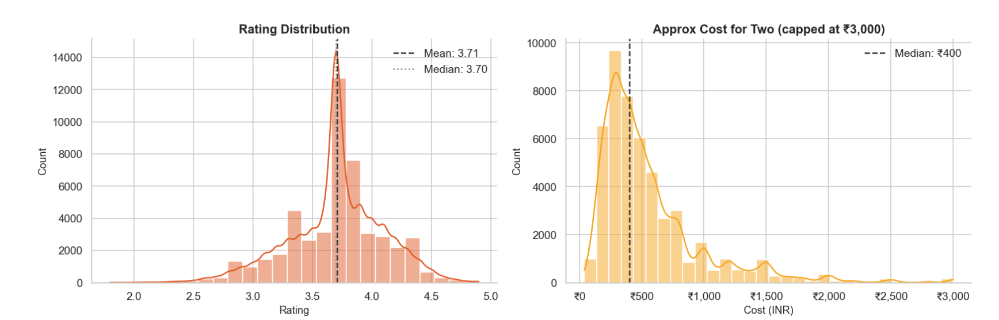
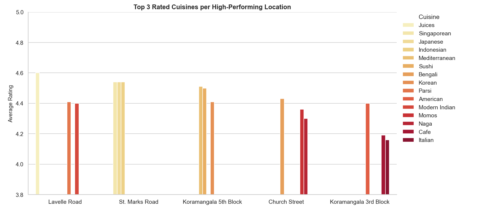
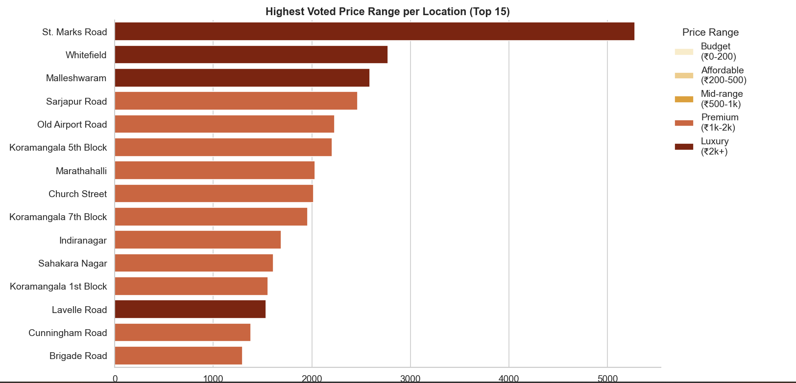

# Zomato Bangalore — Restaurant Analytics

Exploratory data analysis of Bangalore's restaurant ecosystem using the Zomato Kaggle dataset. The project investigates what actually drives restaurant success on Zomato — and where the market gaps are.

> **49,011 restaurants · 23 business questions · 3 statistical tests · 6 actionable findings**

---

## Project Overview

Most Zomato EDA projects stop at bar charts. This one goes further — every major claim is statistically validated, confounding variables are called out explicitly, and findings are framed as business recommendations rather than observations.

The analysis covers:
- What drives ratings — and what doesn't (online ordering turns out not to matter)
- Cuisine performance across Bangalore's neighbourhoods
- Which price ranges actually generate customer engagement
- Where demand far exceeds supply — the real market opportunity

---

## Dataset

| Property | Value |
|---|---|
| Source | [Zomato Bangalore Dataset — Kaggle](https://www.kaggle.com/datasets/himanshupoddar/zomato-bangalore-restaurants) |
| Raw records | 51,717 |
| Clean records | 49,011 |
| Features used | 15 |
| Coverage | Bangalore restaurants listed on Zomato |

---

## Repository Structure

```text
zomato-analytics/
├── zomato_analytics.ipynb       # full analysis notebook
├── images/
│   ├── rating_distribution.png
│   ├── cost_distribution.png
│   ├── top_rated_cuisines.png
│   └── highest_voted_price_range.png
├── README.md
└── .gitignore
```

---

## Skills Demonstrated

`Python` `Pandas` `NumPy` `Seaborn` `Matplotlib` `Statistical Testing` `EDA` `Data Cleaning` `Business Analytics` `Market Analysis` `Insight Generation`

---

## Data Cleaning

| Issue | Fix |
|---|---|
| 2,474 rows with review text in URL column | Dropped — CSV comma-escaping failure, unrecoverable |
| `rate` stored as `'4.1/5'` string | Stripped `/5`, converted to float |
| `approx_cost` with commas (`'1,200'`) | Stripped commas, converted to float |
| `reviews_list` empty brackets (`[]`) | Replaced with `NaN` |
| `dish_liked` — 54% missing | Column dropped |
| `menu_item` — 75% missing | Column dropped |
| Sparse nulls in location, rest_type, cuisines | 232 rows dropped |

---

## Visual Analysis

### Rating Distribution

Most restaurants cluster between 3.5 and 4.0. Mean rating: 3.71. The distribution is left-skewed — very few restaurants fall below 3.0 or above 4.5.


---

### Cost Distribution

Bangalore's restaurant market is concentrated in the affordable segment. Median cost-for-two: approximately ₹400. A long right tail of luxury restaurants pulls the mean higher.



---

### Top Rated Cuisines Across High-Performing Locations

Premium neighbourhoods consistently favour niche international cuisines over mainstream categories — Japanese, Korean, and Mediterranean outrate North Indian and Chinese everywhere.



---

### Highest-Voted Price Range by Location

Premium and luxury restaurants dominate customer engagement. Budget restaurants do not appear in any location's top-voted category.



---

## Analysis Framework

23 questions answered across three layers — univariate first, then bivariate, then multivariate. Order matters: you cannot ask a smart two-variable question until you understand each column individually.

### Layer 1 — Univariate
Rating distribution · Cost distribution · Restaurant type breakdown · Category breakdown

### Layer 2 — Bivariate
Online ordering vs rating · Table booking vs rating · Cost vs engagement · Location performance · Restaurant type performance

### Layer 3 — Multivariate
Cuisine quality by location · Cuisine identity per restaurant type · Category distribution by neighbourhood · Price-range performance by area · Supply-demand gap analysis

---

## Statistical Validation

Three core claims tested formally — not just reported from groupby means.

### Test 1 — Online Ordering vs Rating (Mann-Whitney U)
```
Online Yes:  mean 3.726  (n = 29,013)
Online No:   mean 3.677  (n = 19,998)
p-value:     < 0.0001
Difference:  0.049 rating points
```
**Verdict:** Statistically significant but practically negligible. A 0.049 point gap on a 5-point scale is imperceptible to customers. Online ordering availability does not meaningfully drive ratings.

---

### Test 2 — Table Booking vs Rating (Mann-Whitney U)
```
Book Yes:  mean 4.136  (n = 6,345  — 13% of restaurants)
Book No:   mean 3.642  (n = 42,666)
p-value:   < 0.0001
Difference: 0.494 rating points
```
**Verdict:** Statistically significant and practically meaningful. Nearly half a rating point difference. However — table booking is a proxy for restaurant quality tier, not a direct cause. Restaurants offering table booking self-select into a higher operating standard. Correlation, not causation.

---

### Test 3 — Cost vs Rating (Spearman Correlation)
```
Spearman r:  0.358
p-value:     < 0.0001
Variance explained: ~13%
```
**Verdict:** Moderate-strong positive correlation. Higher cost associates with better ratings but explains only 13% of rating variance. The remaining 87% comes from cuisine quality, service, management, and location — factors not captured by price alone.

---

## Key Findings

### 1. Specialisation beats volume
Niche international cuisines — Japanese, Korean, Mediterranean, Parsi, Singaporean — consistently outrate the most common cuisines regardless of location. Lavelle Road's top-rated cuisine is Juices at 4.60. St. Marks Road's top cluster is Southeast Asian at 4.54. The cuisines ordered most are not the ones rated highest.

---

### 2. Dine-in generates 20× more engagement than delivery
Casual Dining (North Indian): ~2.6 million total votes. Delivery (North Indian): ~126 thousand votes. Customers are far more likely to engage and review when they've had a sit-down experience. Delivery volume does not translate to community engagement.

---

### 3. Restaurant types have distinct cuisine identities

| Format | Top Cuisines |
|---|---|
| Cafes | Burger · Continental · Italian · American |
| Casual Dining | North Indian · Mughlai · Biryani |
| Quick Bites | North Indian · Fast Food · Chinese |
| Delivery | North Indian · Biryani · Chinese |

These are not overlapping markets — they are distinct food cultures operating on the same platform.

---

### 4. Premium spending drives engagement — budget does not
Luxury restaurants (₹2,000+) on St. Marks Road average 5,277 votes. Not a single location's highest-voted restaurant category is Budget or Affordable. The assumption that cheap restaurants are more popular is not supported by this data.

---

### 5. East Bangalore is a dessert zone
Excluding Delivery and Dine-Out, East Bangalore (Whitefield, Bellandur, Marathahalli) is the only zone where Desserts dominates over standard dining. Consistent with the IT corridor's young tech-worker demographic and higher disposable income snacking culture.

---

### 6. Four areas are critically underserved

| Location | Restaurants | Avg Votes | Demand/Supply Ratio |
|---|---|---|---|
| Rajarajeshwari Nagar | 2 | 366 | **183** |
| Central Bangalore | 3 | 383 | **128** |
| West Bangalore | 5 | 222 | 44 |
| North Bangalore | 7 | 229 | 33 |

Three cuisine categories are absent from **all four** underserved zones simultaneously: **South Indian · Cafe · Desserts**. These are the clearest market entry points identified in the analysis.

---

## Business Recommendations

**For restaurant operators:**
- Rajarajeshwari Nagar has a demand/supply ratio of 183 with only 2 restaurants. A South Indian or Cafe concept here faces near-zero competition with demonstrated existing demand.
- Niche cuisine positioning (Japanese, Korean, Mediterranean) consistently outperforms broad menus — specialise rather than generalise.

**For Zomato:**
- Online ordering adoption campaigns will not improve customer satisfaction scores — the 0.049 rating point difference is statistically real but operationally irrelevant.
- Table booking restaurants (13% of listings) generate disproportionately high ratings and engagement — acquisition strategy should prioritise quality-tier restaurants over volume.
- The four underserved zones represent genuine platform growth opportunities where restaurant recruitment would meet existing unmet demand.

---

## Future Enhancements

- [ ] Restaurant rating prediction model (Random Forest)
- [ ] Interactive Power BI dashboard with location drill-down
- [ ] Customer sentiment analysis on reviews_list
- [ ] Restaurant success classification (above/below median votes)
- [ ] Votes normalisation by listing age to improve demand proxy accuracy

---

## Setup

```bash
git clone https://github.com/yashvardhandebas/zomato-analytics.git
cd zomato-analytics
pip install pandas numpy matplotlib seaborn scipy jupyter
```

Download `zomato.csv` from [Kaggle](https://www.kaggle.com/datasets/himanshupoddar/zomato-bangalore-restaurants) and place in the project root, then:

```bash
jupyter notebook zomato_analytics.ipynb
```

---

## Dependencies

```
pandas >= 1.5
numpy >= 1.23
matplotlib >= 3.6
seaborn >= 0.12
scipy >= 1.9
jupyter
```

---

## Author

**Yashvardhan Debas**
[github.com/yashvardhandebas](https://github.com/yashvardhandebas)
